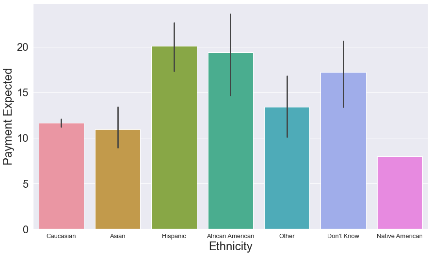
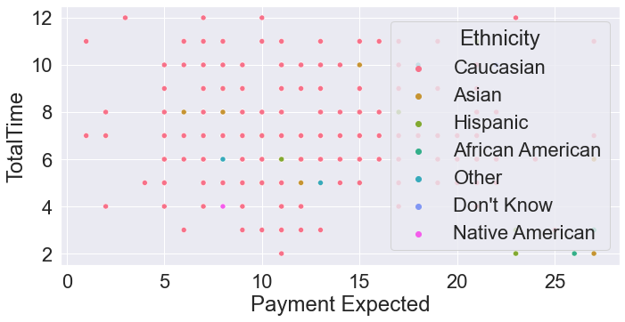
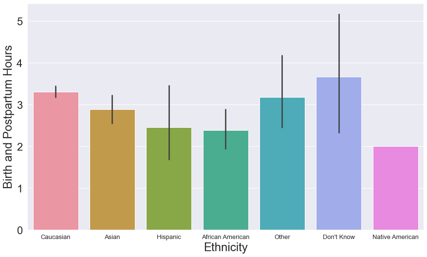
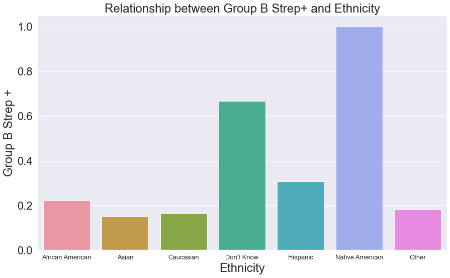

### Childbirth Collective Data Analysis

This dataset was provided by Liz Hochman, President of the Childbirth Collective and owner of birthED in Minnesota. This analysis seeks to the relationships between features such as payment amount, ethnicity of patient, and medical outcomes.

#### Relationship between Payment Expected and Mother's Ethnicity

Hispanic and African American mothers had starkly higher payment expectations from doulas compared to other ethnicities. This diparity is striking because Hispanic and African American communities are also more likely to be disadvantaged and less likely to pursue a doula. More research is needed to understand why this relationship is present. 

#### Relationship between Payment and Length of Labor

There is no relationship between the amount a doula is paid and the length of labor. With the assumption that length of labor is a accurate predictor of the medical outcome of birth, it cannot be extrapolated that the more a doula is paid, the better the outcome will be. This aligns with the results of the TRELS product that highlights most doulas do not contribute to their household income and their motivation for joining the profession is altruistic.

#### Relationship between Client's Ethnicity and Length of Labor

Mother's that reported their ethnicity was other or unknown had slightly higher birth and postpartum hours and variation, on average, but there is no statistical significance. 

#### Notable Relationships between Client's Ethnicity and Significant Occurances
I ran linear regressions for each notable pregnancy occurance with ethnicity as the feature. The r value was consistently below 0.8, so the relationships cannot be attributed to ethnicity alone. However, I have included notable findings below. The sample size is approxmately 600 patients for this question analysis and nearly all ethnic groups had sufficiant representation, according to state demographics. 

- 11% of African Americans and 9% of patients who selected "other" had low amniotic fluid levels (oligohydramnios). 
- 18.5% of Asians had gestational diabetes. 
- 16.7% of participants that responded "Don't Know", 8% Hispanic, and 5.5% African Americans had preeclampsia. 
- 9% of 'Other Ethnicity" patients and 7% of Asians had a premature birth. 

Each of these ethnic groups was overrepresented compared to their composition in the survey. 

This barplot illustrating the percentage of mothers from a particular ethnic group with a Group B streptococcal infection. Although this is often harmless in adults, it can cause serious diseases in new borns. 

The barplot clearly highlights strong disparities between ethnicity and Group B strep rates. Although Group B strep is common and potentially deadly, it can be easily treated. It's a quintessential issue doulas can draw attention to and mitigate racial disparities. 

