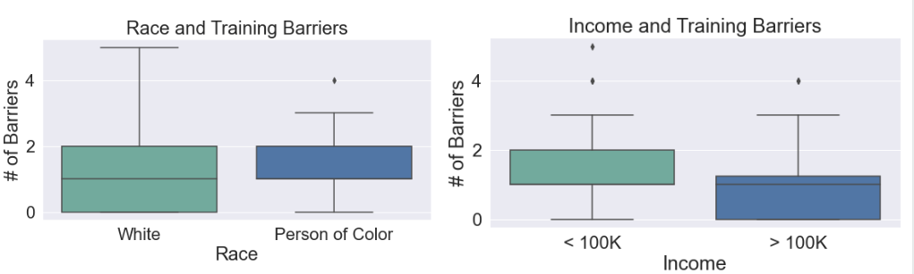
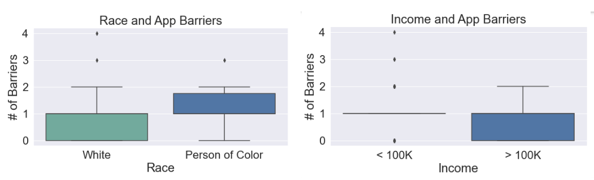
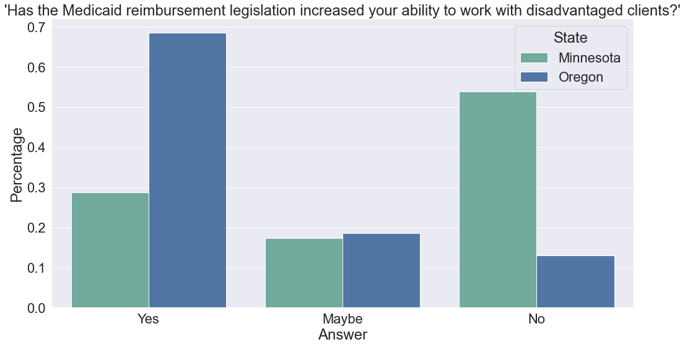
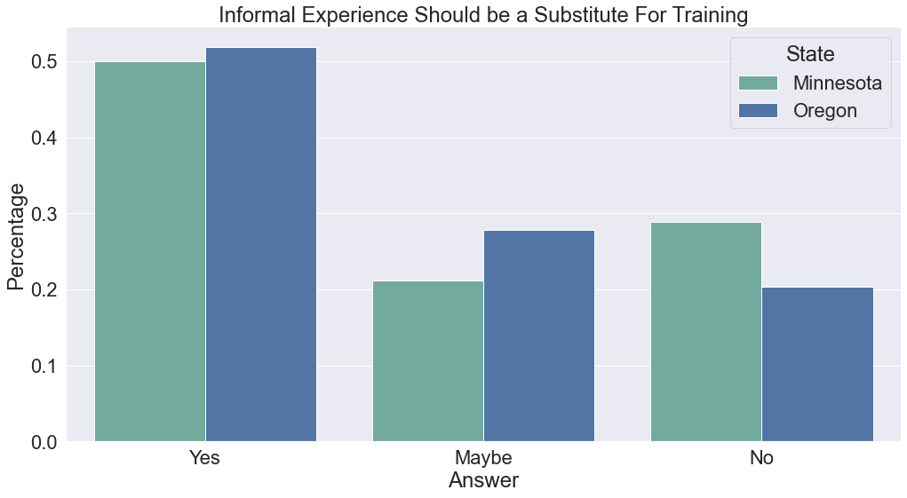
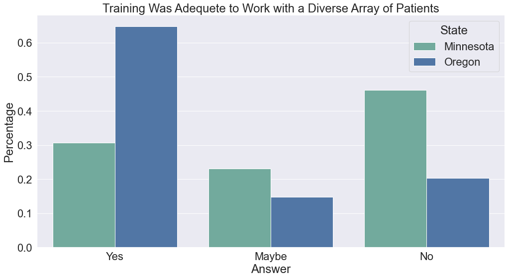

# Results 

## Key Recommendations 
- Waive Application Fee
- Create partnerships with community based training centers to reduce training fees
- Allow previous experience as a substitute for training
- Provide consistent communication to applicants and currently registered doulas to prevent turnover
- Increase reimbursement rates to provide a living wage

### Barriers to Training

There are differences in the numbers of barriers faced by an applicant depending on the applicants race and income. White applicants are more likely to face little obstacles compared to their colored counterparts, this pattern applies to wealthier applicants. This relationship was not statistically significant though. 

| Barrier/State        | Minnesota      | Oregon        |
| :---                 |     :---:      |          ---: |
| Time                 | 19             | 25            |
| Training Fees        | 28             | 30            |
| Distance to Training | 6              | 14            |
| Lack of Knowledge    | 4              | 9             |

The most notable barriers to training, time and training fees, transcend slight state legistlation differences. Key solutions according to informational interviews 
include reviving the grandfather clause (allowing previous experience as a substitute for training) and expanding the centers that are allowed to provide official training. 

### Barriers to Completing Application

There are differences in the numbers of barriers faced by an applicant depending on the applicants race. White applicants are more likely to face little obstacles compared to their colored counterparts. This relationship was not statistically significant though. No relationship exists for income because of the lack of participants with higher incomes. 

| Barrier/State           | Minnesota      | Oregon        |
| :---                    |     :---:      |          ---: |
| Lack of State Response  | 11             | 28            |
| Lack of Community List  |                | 3             |
| Lack of Tech            |                | 8             |
| Lack of Experience      |                | 7             |
| Lack of Documents       |                | 3             |
| Application Fee         | 11             | N/A           |

Minnesota and Oregon had drastically different barriers for completing and submitting the application. For both states participants reported that the states lack of response and communication was the most significant obstacle. Minnesota's process required less materials than but has a $200 applicantion fee. Oregon required more materials but the lack of appropriate technology to complete digital trainings and mandatory experience posed difficulties. 

### Legislation Effectiveness and Improvements

Despite having a similar population and survey representation, there is a notable difference between how effective participants rated the effectivenes of their state's legislation in regards to reaching disadvantaged clients. This disparity can be explained through some key attributes of each state's process. For example, Minnesota has a $200 application fee, whereas Oregon doesn't have one. Minnesota also offers only a handful of limited training centers, compared to Oregon, which has more flexibility. Additionally, Oregon had a grandfather clause that allowed the previous experience to be substituted for training that expired this past June. It is likely many participants of the survey applied or became doulas before the clause expired.

Regardless of state, the majority of participants are in favor of allowing informal experience (attending friends and family's births) as a substitution for formal
training. 

The majority of participants from Oregon reported that their training was adequete and provided them the resources to work with a diverse array of clients. This is likely because Oregon has more flexibility in the centers that are allowed to provide doula training, which allows training centers to tailor their curriculumn to their local community. 

3 barplots again?
boxplots for actual payment and preffered payment 
relationship between payment and length of labor

there is a relationship btwn time and race tho, but must look at medical needs

