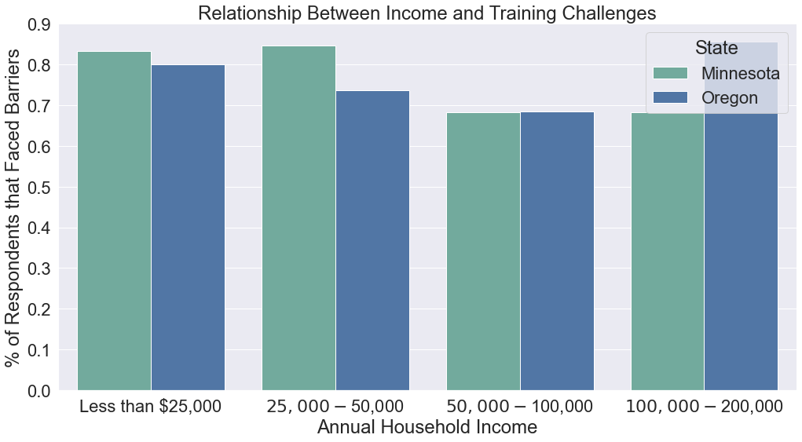
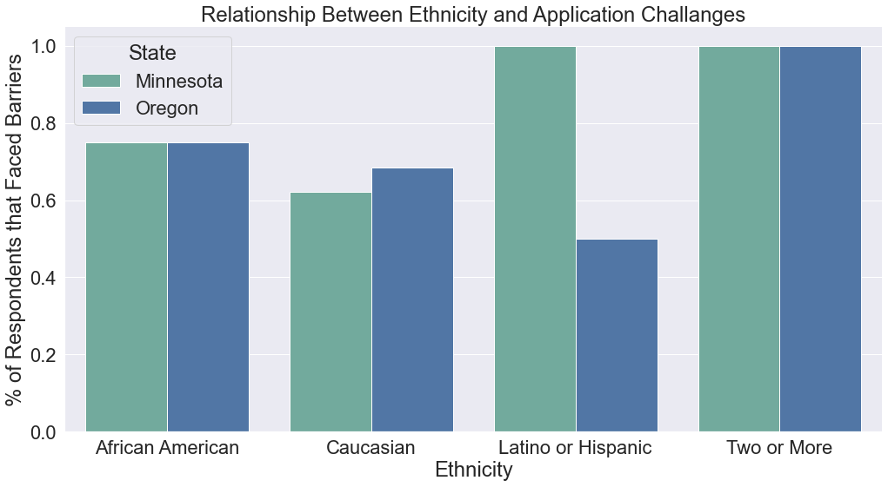
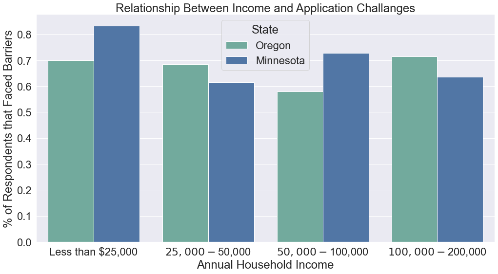
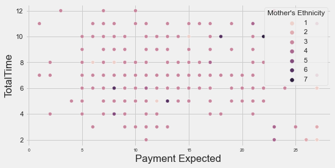

# Results 

## Links to Specific Topics
insert at end 

### Barriers to Training

table of challenges

### Barriers to Completing Application

table of challenges

### Legislation Effectiveness and Improvements

3 barplots again?
boxplots for actual payment and preffered payment 
relationship between payment and length of labor

there is a relationship btwn time and race tho, but must look at medical needs

### Childbirth Collective: doula's impact on racial disparities on maternal and infant health
